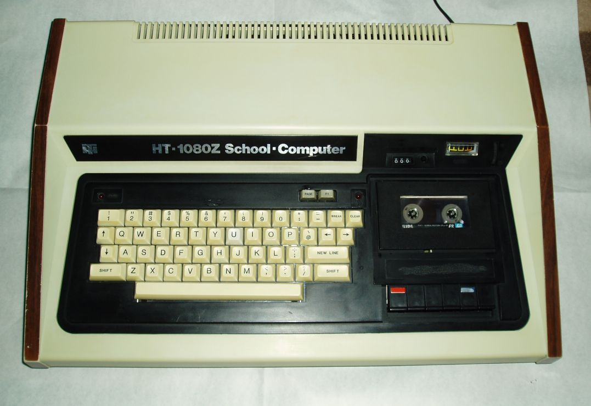

HT1080Z School Computer (TRS80 Model I clone)
=============================================

Based on:

http://joco.homeserver.hu/fpga/mist_ht1080z_en.html

Copyright (c) 2016-2017 Jozsef Laszlo (rbendr@gmail.com)

HT1080Z was a Hungarian school computer, a licensed build of the [EACA Video Genie](https://en.wikipedia.org/wiki/Video_Genie).

CAS file loading (by DrOG)
--------------------------

1. Start the HT1080Z.rbf core.
2. As the 'READY?' prompt appears, press [ENTER] twice. You will see a new 'READY >' prompt at the bottom of the screen.
3. Mount the *.CAS file you want to run from the menu of the MIST (F12->load *.CAS->select the file).
4. - In case of BASIC programs type 'CLOAD' [ENTER], you will see some '*' flashing at the right top of the screen during loading. As the 'READY >' appears again, type 'RUN' [ENTER].
   - If you want to run ML programs, type 'SYSTEM', after pushing [ENTER] you will see a '*?' prompt. Type in the name of the file (max. 6 chars) you have chosen from the menu at step 3. wit
hout extension (i.e. if you want to start the 'ENV.CAS' file, and you mounted it previously, type in 'ENV' [ENTER]). Flashing asterisks again during loading. To the next '*?' prompt type '/
' [ENTER].
